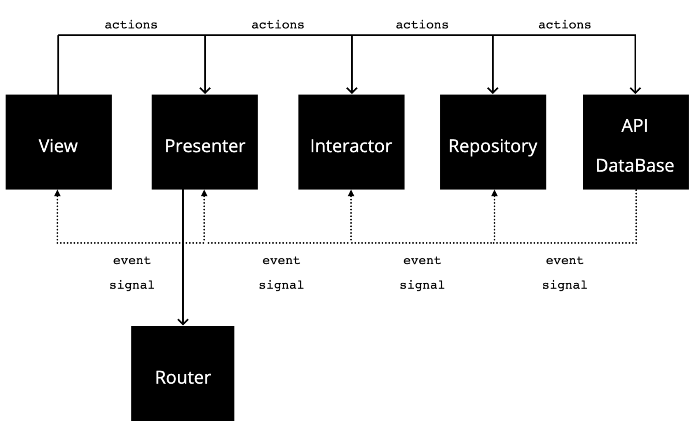

# Photo Viewer

A photo viewer application which consumes a third-party photos API. Basically the application has 3 features:

- List the newest photos uploaded to the API
- Search a photo  by terms
- Show the photo's details which can be downloaded to your photo library. 

There are some improviments that I would like to do if I have more time, which are:

- Dynamic `UICollectionViewCell`'s height by photo (like Pinterest)
- More photo's info like related collections
- A section of favorite photos (maybe save in a local database)
- User session to interact more with the API for example like photos, upload new photos and follow people 

The API that I've used to build these project is from [https://unsplash.com](https://unsplash.com) and I've used requests that doesn't need to be authenticated. It does not provide optimized photos, so the app on debug can appear consuming more memory than others photo viewer apps.

In this project the iOS stack was:

- Swift 5.0
- Xcode 11.3
- VIPER architecture
- Rective programming using `RxSwift` and  `RxCocoa`

## Installation

To manage all dependencies the project is using [Cocoapods](https://cocoapods.org/). 

To install cocoapods you need set your `gemset` on [RVM](https://rvm.io/), run these commands lines on your shell:

```
$ echo photo-viewer-ios > .ruby-gemset && echo 2.6.3 > .ruby-version
$ cd .
```

After install `bundler` to install all gem dependencies:

```
$ gem install bundler
```

Run `bundler`

```
$ bundle
```

After installing cocoapods run this command to install all project's dependencies:

```
$ pod install
```

And then open `PhotoViewer.xcworkspace` and now you can run the project.

## Architecture concept

In VIPER it's normal to use `Input` and `Output` protocols to comunicate between VIPER modules, but with reactive programming we can simplify it by making one way binding. So every module only has the `Input` protocol that contains signals and actions that these modules can do.

So the flow is:



I'm using `RxSwift` to implement this flow without `Input`/`Output` protocols, because I think to use one way binging becomes the code clearer, flexible, light and maintainable.

## Outsource libraries

I've used a couple of outsource libriries to save time to develop the main feature, which are:

- `RxSwift` to have a more flexible code.
- `RxCocoa` to make some cocoa components reactive to be easier integrate with RxSwift events;
- `Moya/RxSwift` is an easy network abstration layer to make request to an API and transforming it to a Rx signal;
- `Mextension` my own library that contains a couple of extensions that I always use in my projects;
- `INSPullToRefresh` to facilitate my infinity list pagination. 

I am fully capable of developing projects without these libraries, but I prefer to use them because I don't have much time and I think the code becomes clearer and easier to maintain. 

